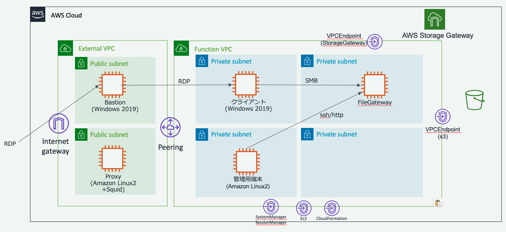

# StorageGateway検証環境
StorageGateway(ファイルゲートウェイ)の検証環境を作成するCloudFormationと手順

# 作成環境



# 作成手順
## (1)ベースの構築
### (1)-(a) CloudFormation用のサービスロールの作成
CloudFormationのスタック作成時にサービスに貸与する、CloudFormation実行用のサービスロールを作成します。
```shell
export Profile=XXXXXXXX
cat > cfn_policy.json << EOL
{
    "Version": "2012-10-17",
    "Statement": [
        {
            "Sid": "",
            "Effect": "Allow",
            "Principal": {
                "Service": "cloudformation.amazonaws.com"
            },
            "Action": "sts:AssumeRole"
        }
    ]
}
EOL
aws --profile ${Profile} iam create-role --role-name CloudFormationServiceRole --assume-role-policy-document file://cfn_policy.json
```
作成したIAMロールのArn(` "Arn": "arn:aws:iam::999999999999:role/CloudFormationServiceRole",`)を控えておきます。
### (1)-(b) デプロイ用シェルのプロファイルとCloudFormationServiceRoleの設定
デプロイ用のシェル(run_cfn.sh)に実行環境のプロファイルと先ほど作成した CloudFormationServiceRoleのArnを設定します。
- run_cfn.shをエディタで開き下記を編集します。
```shell

# list of Environment
Envs[0]=PoC;  ProfileList[0]=XXXXXXX #実行する端末に設定しているプロファイル名に修正する(デフォルトを利用したい場合は、defaultと指定)
EnvsLast=0

#CloudFormation ServiceRole
Role="arn:aws:iam::999999999999:role/CloudFormationServiceRole" #先ほど作成したCloudFormationServiceRoleのArnを設定

```

### (1)-(c) EC2キーペア設定

```shell
KeyPairName="設定しているキーペア名称を設定"

for i in ExterResources/InputParameter-SgPoC-Proxy.json ExterResources/InputParameter-SgPoC-Proxy.json ExterResources/InputParameter-SgPoC-Bastion.json FuncResources/InputParameter-SgPoC-Client.json FuncResources/InputParameter-SgPoC-Manager.json StorageGateway/InputParameter-SgPoC-Gateway1.json
do
    sed -i".bak" -e "s/KEY_PAIR_NAME/${KeyPairName}/g" ${i}
done
```
### (1)-(d) CloudFormationデプロイ 
```shell
./run_cfn.sh SgPoC Iam create
./run_cfn.sh SgPoC VpcFunc create
./run_cfn.sh SgPoC VpcExter create
./run_cfn.sh SgPoC VpcPeer create
./run_cfn.sh SgPoC ExterSg create
./run_cfn.sh SgPoC Bastion create
./run_cfn.sh SgPoC Vpce create
./run_cfn.sh SgPoC Sg create
./run_cfn.sh SgPoC S3 create

./run_cfn.sh SgPoC Client create
./run_cfn.sh SgPoC Manager create

```

## (2)StorageGatewayのVPC Endpointとファイルゲートウェイのインスタンスデプロイ
### (2)-(a) StorageGateway用 VPCE&Logsのデプロイ
```shell
./run_cfn.sh SgPoC StrageVpce create
./run_cfn.sh SgPoC Logs create
```
### (2)-(b) StorageGateway用 Gateway用EC2インスタンスのデプロイ
```shell
./run_cfn.sh SgPoC Gateway1 create

```
## (3) ファイルゲートウェイのアクティベーション
ここからは、Managerインスタンス上でAWS CLIで実行します。
### (3)-(a) Managerインスタンスへのログイン
- マネージメントコンソールを開き、「Systems Manager」のサービスに移動する
- 左のバーから「セッションマネージャー」を選び、「セッションの開始」を押す
- インスタンス名「SgPoC-Manager」を選び、「セッションの開始」を押す
- ログインしたら下記を実行し、ec2-userになり、aws cliの初期設定を行う
```shell
sudo -u ec2-user -i

#AWS Cliアップデート
#FowardProxyIP=<FowardProxy IP Address>
FowardProxyIP=10.2.128.108
FowardProxyPort=3128

curl -x http://${FowardProxyIP}:${FowardProxyPort} \
     -o "get-pip.py" \
     "https://bootstrap.pypa.io/get-pip.py" 
sudo python get-pip.py --proxy="http://${FowardProxyIP}:${FowardProxyPort}"

pip install --upgrade --user awscli --proxy="http://${FowardProxyIP}:${FowardProxyPort}"
echo 'export PATH=$HOME/.local/bin:$PATH' >> ~/.bashrc
. ~/.bashrc


# AWS cli初期設定
Region=$(curl -s http://169.254.169.254/latest/meta-data/placement/availability-zone | sed -e 's/.$//')
aws configure set region ${Region}
aws configure set output json
```
### (3)-（b) アクティベーションキーの取得
ファイルゲートウェイから、 アクティベーションキーを取得します。
取得したアクティベーションキーは
```shell
Gateway1DNS=$(aws --output text ec2 describe-instances --query 'Reservations[*].Instances[*].PrivateIpAddress' --filters "Name=tag:Name,Values=SgPoC-Gateway-1" "Name=instance-state-name,Values=running")
Region=$(curl -s http://169.254.169.254/latest/meta-data/placement/availability-zone | sed -e 's/.$//')
VPCEndpointDNSname=$(aws --output text ec2 describe-vpc-endpoints  --query 'VpcEndpoints[*].DnsEntries[0].DnsName' --filters "Name=service-name,Values=com.amazonaws.ap-northeast-1.storagegateway")

ACTIVATION_KEY=$(curl -s "http://${Gateway1DNS}/?gatewayType=FILE_S3&activationRegion=${Region}&vpcEndpoint=${VPCEndpointDNSname}&no_redirect")

# 確認のため、取得したアクティベーションキーを確認する
echo $ACTIVATION_KEY
```
参考
https://docs.aws.amazon.com/ja_jp/storagegateway/latest/userguide/gateway-private-link.html#GettingStartedActivateGateway-file-vpc

### (3)-（c) アクティベーション
ファイルゲートウェイをアクティベーションします。
```shell
aws storagegateway activate-gateway \
    --activation-key ${ACTIVATION_KEY} \
    --gateway-name SgPoC-Gateway-1 \
    --gateway-timezone "GMT+9:00" \
    --gateway-region ${Region} \
    --gateway-type FILE_S3

#作成したGatewayのARN取得
# atewayState"が "RUNNING"になるまで待つ
GATEWAY_ARN=$(aws --output text storagegateway list-gateways |awk '/SgPoC-Gateway-1/{print $4}')
aws storagegateway describe-gateway-information --gateway-arn ${GATEWAY_ARN}

```
＜参考 gateway-typeの説明>
- "STORED" : VolumeGateway(Store type)
- "CACHED" : VolumeGateway(Cache tyep)
- "VTL"    : VirtualTapeLibrary
- "FILE_S3": File Gateway

### (3)-（d) ローカルディスク設定
ゲートウェイのローカルディスクが割り当てられます。ここでは、これらのディスクを使用するようにゲートウェイを設定します。
```shell

#ローカルストレージの確認
GATEWAY_ARN=$(aws --output text storagegateway list-gateways |awk '/SgPoC-Gateway-1/{print $4}')
DiskIds=$(aws --output text storagegateway list-local-disks --gateway-arn ${GATEWAY_ARN} --query 'Disks[*].DiskId'| sed -e 's/\n/ /')
echo ${DiskIds}

#ローカルストレージの割り当て
aws storagegateway add-cache \
    --gateway-arn ${GATEWAY_ARN} \
    --disk-ids ${DiskIds}

#ローカルストレージの確認
# "DiskAllocationType"が"CACHE STORAGE"で、"DiskStatus"が"present"であることを確認
aws --output text storagegateway list-local-disks --gateway-arn ${GATEWAY_ARN}
```
参照：https://docs.aws.amazon.com/ja_jp/storagegateway/latest/userguide/create-gateway-file.html

### (4)-（e) CloudWatchログ設定
```shell
GATEWAY_ARN=$(aws --output text storagegateway list-gateways |awk '/SgPoC-Gateway-1/{print $4}')
Region=$(curl -s http://169.254.169.254/latest/meta-data/placement/availability-zone | sed -e 's/.$//')
AccuntId=$(curl -s http://169.254.169.254/latest/meta-data/identity-credentials/ec2/info|awk '/AccountId/{ i=gsub( /"/, "", $3); print $3}')

aws storagegateway update-gateway-information \
    --gateway-arn ${GATEWAY_ARN} \
    --cloud-watch-log-group-arn "arn:aws:logs:a${Region}:${AccuntId}:log-group:StorageGW-Gateway-1"
```

## (４) ファイル共有の作成
とりあえず、「ゲストアクセスによる SMB ファイル共有」で簡易確認

参照:
- https://docs.aws.amazon.com/ja_jp/storagegateway/latest/userguide/GettingStartedCreateFileShare.html
- https://docs.aws.amazon.com/ja_jp/storagegateway/latest/userguide/CreatingAnSMBFileShare.html

### (4)-（a) SMB設定(SMBSecurityStrategy)
```shell
GATEWAY_ARN=$(aws --output text storagegateway list-gateways |awk '/SgPoC-Gateway-1/{print $4}')

aws storagegateway update-smb-security-strategy \
    --gateway-arn ${GATEWAY_ARN} \
    --smb-security-strategy MandatoryEncryption
```
### (4)-（b) ゲストアクセス用の SMB ファイル共有を設定
```shell
PASSWORD="HogeHoge@"
aws storagegateway set-smb-guest-password \
    --gateway-arn ${GATEWAY_ARN} \
    --password ${PASSWORD}
```
### (4)-（c) SMBファイル共有
```shell
#情報取得
BUCKETARN=$(aws --output text cloudformation describe-stacks --stack-name SgPoC-S3 --query 'Stacks[*].Outputs[*].[OutputKey,OutputValue]' | awk -e '/StorageGatewayStoredS3BucketArn/{print $2}')
ROLE=$(aws --output text cloudformation describe-stacks --stack-name SgPoC-Iam --query 'Stacks[*].Outputs[*].[OutputKey,OutputValue]' |awk -e '/StorageGatewayBucketAccessRoleArn/{print $2}')
GATEWAY_ARN=$(aws --output text storagegateway list-gateways |awk '/SgPoC-Gateway-1/{print $4}')
echo -e "BUCKET=${BUCKETARN}\nROLE=${ROLE}\nGATEWAY_ARN=${GATEWAY_ARN}"

#実行
aws storagegateway create-smb-file-share \
    --client-token aaaaaaaaaa \
    --gateway-arn "${GATEWAY_ARN}" \
    --location-arn "${BUCKETARN}" \
    --role "${ROLE}" \
    --object-acl bucket-owner-full-control \
    --default-storage-class S3_STANDARD \
    --guess-mime-type-enabled \
    --authentication GuestAccess
```
## (5) クライアントからのマウントテスト
```shell
rem 共有接続と切断(ドライブレター割り当て)
net use E: \\＜GatewayのIP>\＜S３バケット名と同一> /user:<Gateway名称>\smbguest
net use
net use E: /delete

rem 共有接続と切断(UNC、IPアドレスでの接続)
net use \\＜GatewayのIP>\＜S３バケット名と同一> /user:<Gateway名称>\smbguest
net use
net use \\＜GatewayのIP>\＜S３バケット名と同一> /delete


rem 共有接続と切断(UNC、FQDNでの接続)
net use \\＜GatewayのFQDN＞\＜S３バケット名と同一> /user:<Gateway名称>\smbguest
net use
net use \\＜GatewayのFQDN＞\＜S３バケット名と同一> /delete
```
## (6)Managerインスタンスからのsshメンテナンスログテインテスト
ManagerインスタンスにSystem Managerでログインする
```shell
sudo -u ec2-user -i
# キーペアの秘密鍵設定
cat > ~/.ssh/id_rsa
<キーペアの秘密鍵を入力し、"ctr＋d"で終了>
chmod 600 ~/.ssh/id_rsa

#ゲートウェイのIP取得
Gateway1DNS=$(aws --output text ec2 describe-instances --query 'Reservations[*].Instances[*].PrivateIpAddress' --filters "Name=tag:Name,Values=SgPoC-Gateway-1" "Name=instance-state-name,Values=running")

#sshログイン
ssh admin@${Gateway1DNS}
```
Storage Gatewayのローカルコンソール
```
        AWS Storage Gateway - Configuration

        #######################################################################
        ##  Currently connected network adapters:
        ##
        ##  eth0: 10.1.167.130
        #######################################################################

        1: Configure HTTP Proxy
        2: Network Configuration
        3: Test Network Connectivity
        4: View System Resource Check (0 Errors)
        5: Command Prompt

        Press "x" to exit session

        Enter command:
```
参考
https://docs.aws.amazon.com/ja_jp/storagegateway/latest/userguide/ec2-local-console-fwg.html#EC2_MaintenanceGatewayConsole-fgw


